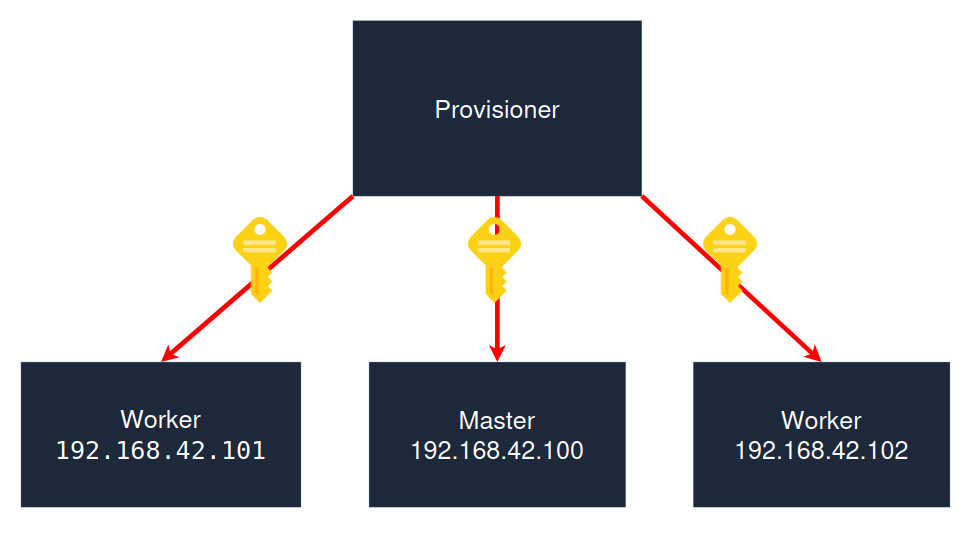

# How It Works

Instead of manually setting up each server, you define your entire cluster—all your controller and worker nodes—in a single YAML configuration file (k0sctl.yaml).

Then, you simply run one command: `k0sctl apply`.

The tool takes care of everything else:

* Connecting to your servers via SSH.
* Installing the k0s software.
* Configuring the nodes to form a complete, production-ready cluster.

## What You'll Need (Requirements)

To make this magic happen, you only need a few things:

### 1. On Your Local Machine (where you run the command):

* The `k0sctl` tool itself.
* An SSH client with a private key.

### 2. For Each Target Server (your future nodes):

* A supported OS (like Ubuntu, Debian, RHEL, or Windows Server).
* An SSH server that is running.
* A user account with `sudo` (or root) privileges.
* The public part of your SSH key added to that user's authorized keys for passwordless login.

## Example k0sctl.yaml

```yaml
apiVersion: k0sctl.k0sproject.io/v1beta1
kind: Cluster
metadata:
  name: k0s-cluster
spec:
  hosts:
  - role: controller # with "+worker" if you want the node to be visable via kubectl, it will on default have a taint (NoSchedule)
    ssh:
      address: 192.168.42.100 # replace with the controller's IP address
      user: ubuntu # Replace with requierd user ("ubuntu" for ubuntu instances) 
      keyPath: ~/.ssh/id_rsa # key path on host system used to provision cluster
  - role: worker
    ssh:
      address: 192.168.42.102 # replace with the worker's IP address
      user: root
      keyPath: ~/.ssh/id_rsa
  - role: worker
    ssh:
      address: 192.168.42.101 # replace with the worker's IP address
      user: ubuntu
      keyPath: ~/.ssh/id_rsa
k0s:
  config:
    spec:
      network:
        provider: calico
        calico:
          mode: vxlan  # or 'ipip' depending on your network requirements
          overlay: Always  # or 'CrossSubnet' or 'Never'
          mtu: 1500  # adjust based on your network MTU
          wireguard: false  # set to true if you want WireGuard encryption
```



*For the automated setup to succeed, the provisioner requires passwordless SSH access to each node. This is only possible if the provisioner's public SSH key is added to the ~/.ssh/authorized_keys file on the Master and all Worker nodes. This step is essential for the secure, automated installation of the Kubernetes cluster.*

## Key Takeaway

k0sctl provides an **Infrastructure as Code** approach to cluster management. It makes deploying, upgrading, and managing k0s clusters **simple, automated, and repeatable**.

## Important Note

This template (**k0sctl.yaml**) has only been tested in a practice enviroment, and further validation and hardening are required before any production deployment. This template serves as a baseline and does not include configurations for specific security, scaling, or monitoring needs."

